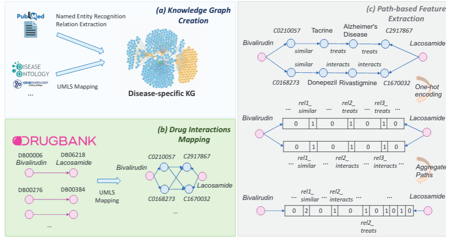

# Drug-Drug Interaction Prediction on a Biomedical Literature Knowledge Graph (DDI-BLKG)
Model drug-drug interactions (DDIs) based on a KG graph and use them to predict whether a DDI is probable.

Our model is based on extracting the semantic paths that connect two drug nodes in the KG. The KG created is disease-specific and based on biomedical literature and manually annotated DBs such as [D0](), [G0]() and [MeSH](). An overview of this process can be seen in the following picture:





More details can be found in our work (link will be added soon)

In this repository exists  a sample script (*run\_experiment\_AIME2020.py*) to replicate the results comparing the different methodologies presented.

Moreover, a notebook for data exploration is provided in the examples folder.

For the full workflow of creating the knowledge graph one should also visit
the [Biomedical Knowledge Integration repo](https://github.com/tasosnent/Biomedical-Knowledge-Integration) for setting up the Harvesters and the Extraction/Indexing Tools.


This is a work in progress. Feel free to contact me if anything is amiss.

## Overview

This work presents a new paradigm for predicting probable DDIs by tackling the problem, as a link-prediction task between drugs in a biomedical KG. The KG is disease-specific and is created by harvesting and analyzing disease-specific literature and structured databases as in the following:


### Data:

In order to run the script and the notebook you will need to download the preprocessed datasets and place them in the *data* folder.

More specifically you need to download [from here](https://owncloud.skel.iit.demokritos.gr/index.php/s/WFpHQ6aegYK1J7M):
 
 - The feature vectors for the drug pairs for the DDI_BLKG method.
 - The graph embeddings of the drug pairs for the different competing methods.
 
As complementary material the KGs for the two diseases in the form of semantic triples (i.e. subject - relation - object) can be found in the following links for further experimentation:

 - [Alzheimer's Disease KG]()
 - [Lung Cancer KG]()
 
The details regarding the two KGs in terms of size, can be seen in the following table:


These were created by harvesting related publications and the aforementioned structured DBs. More details regarding the different data sources and the number of knowledge items fetched from each one can be seen in the following table:


### Requirements:
Install the requirements

pip install -r requirements.txt

### Module:

You can also install the module if you would like to check it out from ipython.
```sh
git clone this_project
cd projectfolder
pip install --user .
```


## Example usage:
Run the following to generate the results as reported in our studies:
```python
python aime2020_results.py
```

## Tests

Currently no tests supported.

## Questions/Errors
Bougiatiotis Konstantinos, NCSR ‘DEMOKRITOS’ E-mail: bogas.ko@gmail.com

